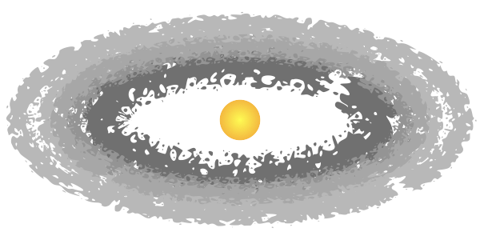

# SysSimPyMMEN

Inferring the minimum-mass extrasolar nebula (MMEN) from the SysSim models.

For installation instructions, tutorials, and detailed documentation, [read the documentation](https://syssimpymmen.readthedocs.io/).
