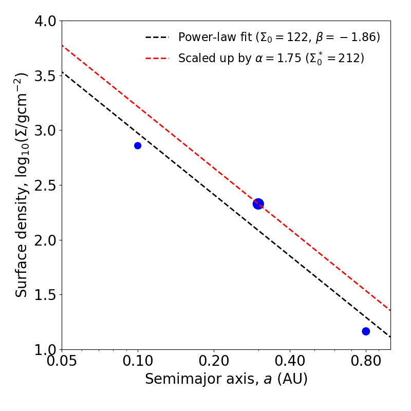
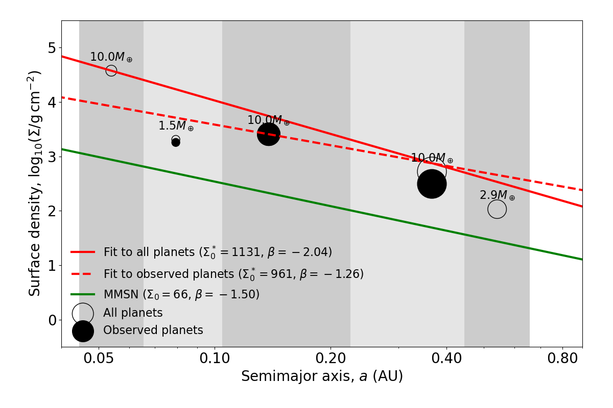
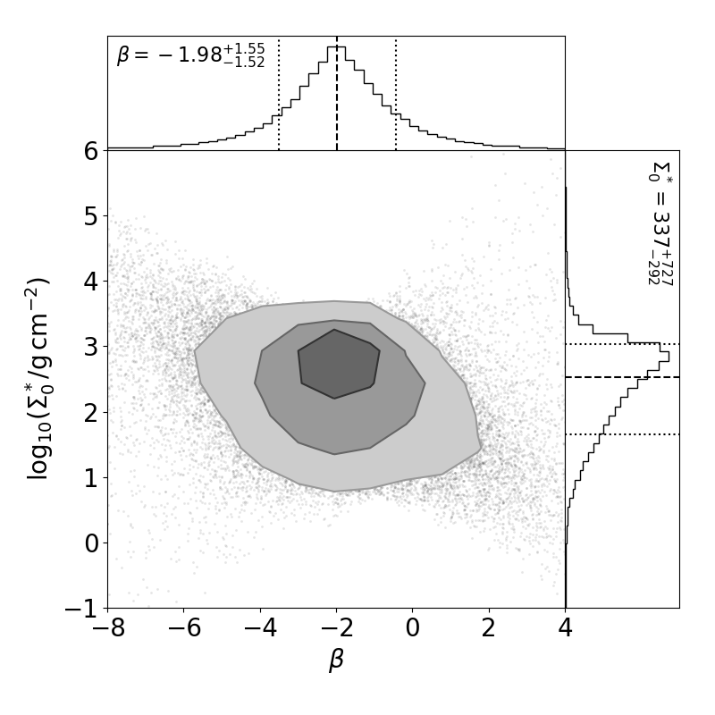

Fitting individual systems
==========================

The usage for fitting individual planetary systems can be exactly the same as for fitting a catalog! On the :ref:`previous page <basic_usage>`, the inputs ``planet_masses`` and ``planet_semi_a`` could have been either arrays for many planets in an entire catalog, or arrays of just a few planets in a single planetary system. The following shows an example of fitting three hypothetical planets in the same system:

.. code-block:: python

   planet_masses = np.array([1.7, 4.5, 2.2]) # arbitrary planet masses (Earth masses)
   planet_semi_a = np.array([0.1, 0.3, 0.8]) # arbitrary semi-major axes (AU)

   sigmas = solid_surface_density_CL2013(planet_masses, planet_semi_a) # g/cm^2
   a0 = 0.3 # AU; separation for the normalization constant
   sigma0, beta = fit_power_law_MMEN(planet_semi_a, sigmas, a0=a0)

Scaling up solid surface densities
----------------------------------

You may want to "scale up" the power-law fit such that it is at least above solid surface densities of each planet in the system. After-all, the concept of a MMEN is to estimate the minimum surface density profile containing enough mass to form every planet in their present locations, and thus the surface density must be at least equal to that local to each planet!

This is easily done via the following function:

.. code-block:: python

   sigma0_scaled, beta, scale_factor = fit_power_law_and_scale_up_MMEN(planet_semi_a, sigmas, a0=a0)

Here, ``scale_factor`` is a value greater than or equal to one, and the power-law normalization ``sigma0`` has already been multiplied by the scale factor. The power-law slope (``beta``) should be unaffected. You can visually check the effect of the scaling by plotting the scaled and un-scaled power-law profiles:

.. code-block:: python

   # Plot solid surface density vs semi-major axis:
   fig = plt.figure(figsize=(8,8))
   plot = GridSpec(1,1,left=0.15,bottom=0.15,right=0.95,top=0.95,wspace=0,hspace=0)
   ax = plt.subplot(plot[0,0])
   plt.scatter(planet_semi_a, np.log10(sigmas), marker='o', s=50*planet_masses, color='b')
   a_array = np.linspace(1e-3,2,1001)
   plt.plot(a_array, np.log10(MMEN_power_law(a_array, sigma0, beta, a0=a0)), lw=2, ls='--', color='k', label=r'Power-law fit ($\Sigma_0 = {:0.0f}$, $\beta = {:0.2f}$)'.format(sigma0, beta))
   plt.plot(a_array, np.log10(MMEN_power_law(a_array, sigma0_scaled, beta, a0=a0)), lw=2, ls='--', color='r', label=r'Scaled up by $\alpha = {:0.2f}$ ($\Sigma_0^* = {:0.0f}$)'.format(scale_factor, sigma0_scaled))
   ax.tick_params(axis='both', labelsize=20)
   plt.gca().set_xscale("log")
   ax.get_xaxis().set_major_formatter(ticker.ScalarFormatter())
   plt.xticks([0.05, 0.1, 0.2, 0.4, 0.8])
   plt.xlim([0.05,1.])
   plt.ylim([1.,4.])
   plt.xlabel(r'Semimajor axis, $a$ (AU)', fontsize=20)
   plt.ylabel(r'Surface density, $\log_{10}(\Sigma/{\rm g cm}^{-2})$', fontsize=20)
   plt.legend(loc='upper right', bbox_to_anchor=(1.,1.), ncol=1, frameon=False, fontsize=16)
   plt.show()

   The MMEN fit to an example system with three planets, with and without scaling up.

Visualizing individual systems
------------------------------

We provide a function for fitting and plotting individual systems from a simulated physical catalog. For each system, it will fit an MMEN power-law to the observed (transiting) planets in the system, and then to all the planets in the system, to illustrate how undetected planets can bias the fit. Try it!

.. code-block:: python

   from syssimpyplots.general import *
   from syssimpyplots.load_sims import *

   from syssimpymmen.mmen import *

   # Load a simulated catalog:
   load_dir = '/path/to/a/simulated/catalog/' # replace with your path where you downloaded a simulated catalog!

   # To load and process the simulated physical catalog of stars and planets:
   sssp_per_sys, sssp = compute_summary_stats_from_cat_phys(file_name_path=load_dir, load_full_tables=True)

   # To loop through and plot individual physical systems with at least 3 observed planets:
   a0 = 0.3
   prescription = 'RC2014' # choose the prescription for the feeding zones
   plot_feeding_zones_and_power_law_fit_MMEN_per_system_observed_and_physical(sssp_per_sys, sssp, n_mult_min=3, prescription=prescription, a0=a0, scale_up=True, N_sys=10)

   An example of how missing planets can alter the inferred MMEN for a given system.

Plotting a diversity of MMEN
----------------------------

You can fit MMEN to a large number of systems, and then plot the distribution of power-law parameters (i.e. ``sigma0`` and ``beta``) using the ` ``plot_2d_points_and_contours_with_histograms`` function from SysSimPyPlots <https://syssimpyplots.readthedocs.io/en/latest/api_plot_params.html#syssimpyplots.plot_params.plot_2d_points_and_contours_with_histograms>`_:

.. code-block:: python

   # To import the "plot_2d_points_and_contours_with_histograms()" function:
   from syssimpyplots.plot_params import *

   scale_up = True
   y_sym = '\Sigma_0^*' if scale_up else '\Sigma_0'

   # Fit a power-law to each system in the physical catalog:
   fit_per_sys_dict = fit_power_law_MMEN_per_system_physical(sssp_per_sys, sssp, prescription=prescription, a0=a0, scale_up=True, N_sys=100000) # may take a minute

   # To plot the distribution of fitted power-law parameters (sigma0 vs. beta):
   plot_2d_points_and_contours_with_histograms(fit_per_sys_dict['beta'], fit_per_sys_dict['sigma0'], x_min=-8., x_max=4., y_min=1e-1, y_max=1e6, log_y=True, xlabel_text=r'$\beta$', ylabel_text=r'$\log_{10}(%s/{\rm g\,cm^{-2}})$' % y_sym, y_str_format='{:0.0f}', x_symbol=r'$\beta$', y_symbol=r'$%s$' % y_sym)
   plt.show()

   The distribution of power-law fit parameters from a physical catalog, showing the diversity of MMEN.
