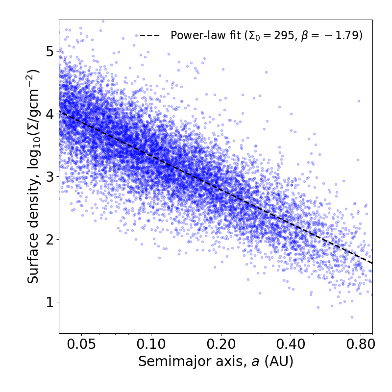

.. _basic_usage:

Basic usage
===========

Computing solid surface densities
---------------------------------

You can compute the solid surface densities of the annular disks required to form each planet from their masses and semi-major axes:

.. code-block:: python

   sigmas = solid_surface_density_CL2013(planet_masses, planet_semi_a) # g/cm^2

where ``planet_masses`` is an array of the planet masses (in Earth masses) and ``planet_semi_a`` is an array of the planet semi-major axes (in AU).

Here, we've used the Chiang & Laughlin (2013) prescription for the feeding zone of each planet, which simply sets them equal to their semi-major axes; the output ``sigmas`` is an array of solid surface densities computed for each planet.

.. tip::

   Several other prescriptions are available; see :py:func:`solid_surface_density_S2014 <syssimpymmen.mmen.solid_surface_density_S2014>`, :py:func:`solid_surface_density_nHill <syssimpymmen.mmen.solid_surface_density_nHill>`, and :py:func:`solid_surface_density_system_RC2014 <syssimpymmen.mmen.solid_surface_density_system_RC2014>`.
   Some of these may require additional parameters, such as the planet radii (for "S2014") and the stellar mass (for "S2014" and "nHill").

You can also define and use your own custom prescription for the feeding zone width (``delta_a``) by using the core function that all of the above functions call, :py:func:`solid_surface_density <syssimpymmen.mmen.solid_surface_density>`.

Fitting a power-law
-------------------

It is easy to fit a power-law to the solid surface densities as a function of semi-major axis:

.. code-block:: python

   a0 = 0.3 # AU; separation for the normalization constant
   sigma0, beta = fit_power_law_MMEN(planet_semi_a, sigmas, a0=a0)

Here, ``sigma0`` is the normalization constant for the solid surface density (g/cm^2) at the chosen separation ``a0``, and ``beta`` is the slope or power-law index.

An example using a SysSim catalog
---------------------------------

A full working example using a simulated catalog is shown below (make sure to replace ``load_dir`` with the path to where you downloaded the simulated catalog):

.. code-block:: python

   from syssimpyplots.general import *
   from syssimpyplots.load_sims import *

   from syssimpymmen.mmen import *

   # Load a simulated catalog:
   load_dir = '/path/to/a/simulated/catalog/' # replace with your path where you downloaded a simulated catalog!
   sss_per_sys, sss = compute_summary_stats_from_cat_obs(file_name_path=load_dir)

   # Compute solid surface densities for all planets in the catalog:
   sigma_obs_CL2013, mass_obs, a_obs = solid_surface_density_CL2013_given_observed_catalog(sss_per_sys, max_core_mass=np.inf)

   # Fit a power-law profile for the MMEN:
   a0 = 0.3 # AU; choice for the normalization point
   sigma0_obs_CL2013, beta_obs_CL2013 = fit_power_law_MMEN(a_obs, sigma_obs_CL2013, a0=a0)

   # Plot solid surface density vs semi-major axis:
   fig = plt.figure(figsize=(8,8))
   plot = GridSpec(1,1,left=0.15,bottom=0.15,right=0.95,top=0.95,wspace=0,hspace=0)
   ax = plt.subplot(plot[0,0])
   plt.scatter(a_obs, np.log10(sigma_obs_CL2013), marker='o', s=10, alpha=0.2, color='b')
   a_array = np.linspace(1e-3,2,1001)
   plt.plot(a_array, np.log10(MMEN_power_law(a_array, sigma0_obs_CL2013, beta_obs_CL2013, a0=a0)), lw=2, ls='--', color='k', label=r'Power-law fit ($\Sigma_0 = {:0.0f}$, $\beta = {:0.2f}$)'.format(sigma0_obs_CL2013, beta_obs_CL2013))
   ax.tick_params(axis='both', labelsize=20)
   plt.gca().set_xscale("log")
   ax.get_xaxis().set_major_formatter(ticker.ScalarFormatter())
   plt.xticks([0.05, 0.1, 0.2, 0.4, 0.8])
   plt.xlim([0.04,0.9])
   plt.ylim([0.5,5.5])
   plt.xlabel(r'Semimajor axis, $a$ (AU)', fontsize=20)
   plt.ylabel(r'Surface density, $\log_{10}(\Sigma/{\rm g cm}^{-2})$', fontsize=20)
   plt.legend(loc='upper right', bbox_to_anchor=(1.,1.), ncol=1, frameon=False, fontsize=16)
   plt.show()

   The solid surface densities and MMEN fit to a simulated observed catalog.

.. note::

   In this example, the function :py:func:`solid_surface_density_CL2013_given_observed_catalog <syssimpymmen.mmen.solid_surface_density_CL2013_given_observed_catalog>` takes the observed catalog, uses a mass-radius relation to draw a set of planet masses from the planet radii, and enforces a limit on the maximum mass via ``max_core_mass`` before calling the function :py:func:`solid_surface_density_CL2013 <syssimpymmen.mmen.solid_surface_density_CL2013>` we started with at the top of this page.

   We've removed the maximum core mass limit (by setting ``max_core_mass=np.inf``) to show you the broad range of surface densities arising from the broad range of planet masses. By default, it is set to 10 Earth masses.
